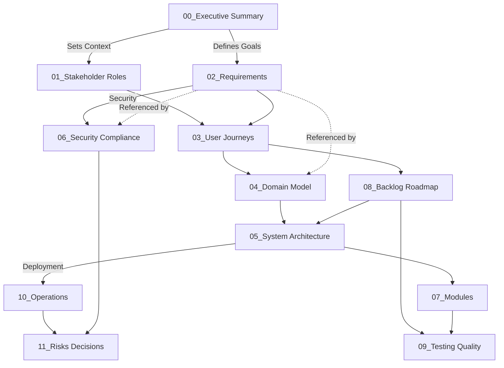

# Nano-Marktplatz: Projektplanungs-Dokumentation

---

## 📋 Überblick

Dieses Verzeichnis (`/doc/planning/`) enthält die **vollständige professionelle Projektplanung** für die Entwicklung des **Nano-Marktplatzes** — einer B2B-Plattform zur Vernetzung von Weiterbildungsanbietern und Unternehmen.

Die Planung ist abgeleitet aus einer **Studienarbeit** (Januar 2025) und folgt Engineering-Best-Practices zur Production-Grade-Entwicklung.

---

## 🗂️ Dokumentenstruktur

### Phase 1: Strategie & Anforderungen

| Dokument | Fokus | Audience |
|----------|-------|----------|
| **[00_executive_summary.md](./00_executive_summary.md)** | Produktvision, Zielgruppen, Investitionsbudget | Stakeholder, Management |
| **[01_stakeholder_roles.md](./01_stakeholder_roles.md)** | Rollenmodell (Admin, Creator, Consumer, Moderator), RBAC, Onboarding | Product, Ops |
| **[02_requirements.md](./02_requirements.md)** | Fachliche Anforderungen (Muss/Soll/Kann), DSGVO, Sicherheit | Engineering, Product |

### Phase 2: Design & Architecture

| Dokument | Fokus | Audience |
|----------|-------|----------|
| **[03_user_journeys.md](./03_user_journeys.md)** | End-to-End User Flows mit Wireframes-Äquivalenten | Product, UX, QA |
| **[04_domain_model.md](./04_domain_model.md)** | Entity-Relationship-Modell, Datenstrukturen, Datenbankdesign | Engineering, Architecture |
| **[05_system_architecture.md](./05_system_architecture.md)** | System-Design, AWS Deployment, Microservices-Migration | Architecture, DevOps |

### Phase 3: Umsetzung & Qualität

| Dokument | Fokus | Audience |
|----------|-------|----------|
| **[06_security_compliance.md](./06_security_compliance.md)** | DSGVO, Authentifizierung, Verschlüsselung, Threat Model | Security, Legal |
| **[07_modules.md](./07_modules.md)** | Modularer Aufbau (10 Module), Inter-Module Communication | Engineering, Architects |
| **[08_backlog_roadmap.md](./08_backlog_roadmap.md)** | User Stories, Sprint-Planung, Releases (MVP → Phase 2) | Product, Scrum Master |
| **[09_testing_quality.md](./09_testing_quality.md)** | Test-Pyramide, Unit/Integration/E2E Tests, Security Tests | QA, Engineering |

### Phase 4: Betrieb & Risiken

| Dokument | Fokus | Audience |
|----------|-------|----------|
| **[10_operations_observability.md](./10_operations_observability.md)** | Monitoring, Logging, Alerting, Incidents, Disaster Recovery | Ops, Engineering |
| **[11_risks_decisions.md](./11_risks_decisions.md)** | Risikoregister, Annahmen, Architekturentscheidungen (ADRs) | Executive, Architecture |

---

## 🎯 Abhängigkeitsgraph

---

## 📖 Leseanleitung nach Interessengebiet

### 🎯 Für Product Manager:
1. **[00_executive_summary.md](./00_executive_summary.md)** – Produktvision, Budget, Kritische Erfolgsfaktoren
2. **[01_stakeholder_roles.md](./01_stakeholder_roles.md)** – Rollenmodell, User Needs
3. **[03_user_journeys.md](./03_user_journeys.md)** – End-to-End Flows
4. **[08_backlog_roadmap.md](./08_backlog_roadmap.md)** – Sprint-Planung, Roadmap
5. **[11_risks_decisions.md](./11_risks_decisions.md)** – Annahmen, Open Questions

### 👨‍💻 Für Software Engineer:
1. **[02_requirements.md](./02_requirements.md)** – Fachliche Anforderungen (Queries für Stories)
2. **[04_domain_model.md](./04_domain_model.md)** – Datenbank-Schema, Entities
3. **[05_system_architecture.md](./05_system_architecture.md)** – Tech Stack, API Design
4. **[07_modules.md](./07_modules.md)** – Code-Organisation, Dependencies
5. **[06_security_compliance.md](./06_security_compliance.md)** – Sicherheits-Anforderungen
6. **[09_testing_quality.md](./09_testing_quality.md)** – Test-Strategie

### 🏗️ Für Architect:
1. **[05_system_architecture.md](./05_system_architecture.md)** – AWS-Deployment, Skalierung
2. **[04_domain_model.md](./04_domain_model.md)** – Datenmodell, DB-Wahl
3. **[07_modules.md](./07_modules.md)** – Modular-Monolith-Design
4. **[11_risks_decisions.md](./11_risks_decisions.md)** – ADRs, Alternativen-Evaluationen
5. **[10_operations_observability.md](./10_operations_observability.md)** – SLOs, Capacity Planning

### 🔒 Für Security Officer:
1. **[06_security_compliance.md](./06_security_compliance.md)** – DSGVO, Authentifizierung, Encryption
2. **[04_domain_model.md](./04_domain_model.md)** – Datenklassifizierung
3. **[09_testing_quality.md](./09_testing_quality.md)** – Security Tests
4. **[11_risks_decisions.md](./11_risks_decisions.md)** – Threat Model

### 🚀 Für DevOps / Infrastructure:
1. **[05_system_architecture.md](./05_system_architecture.md)** – AWS Setup, ECS, RDS, S3
2. **[10_operations_observability.md](./10_operations_observability.md)** – Monitoring, Incidents
3. **[06_security_compliance.md](./06_security_compliance.md)** – SSL/TLS, Encryption at-Rest

### ✅ Für Quality Assurance:
1. **[03_user_journeys.md](./03_user_journeys.md)** – Test Cases aus Flows
2. **[02_requirements.md](./02_requirements.md)** – Akzeptanzkriterien
3. **[09_testing_quality.md](./09_testing_quality.md)** – Test-Strategie, Checklisten
4. **[08_backlog_roadmap.md](./08_backlog_roadmap.md)** – Sprint-Planung

---

## 🔄 Lebenzyklus der Dokumentation

### Phase 1: MVP (Q3 2025)
- Alle Dokumente 00-11 erstellt & reviewed
- Technische Designs finalisiert
- Backlog in Jira/Linear eingegeben

### Phase 1: Launch (Q4 2025 - Q1 2026)
- ADRs bei Änderungen updated (git)
- Neue Learnings in [11_risks_decisions.md](./11_risks_decisions.md) dokumentiert
- Roadmap angepasst basierend auf Metrics

### Phase 2+: Microservices (H1 2026+)
- [05_system_architecture.md](./05_system_architecture.md) → Microservices Section erweitert
- [07_modules.md](./07_modules.md) → Service-Boundaries neu definiert
- [10_operations_observability.md](./10_operations_observability.md) → Multi-Service Observability

---

## ⚠️ Kritische Entscheidungen (MVP Go-Live)

| Entscheidung | Status | Deadline |
|-------------|--------|----------|
| Technologie-Stack (FastAPI? React?) | ✅ Agreed | Sprint 0 |
| AWS Region (us-west-2?) | ⏳ Pending | Sprint 1 |
| Moderation-Staffing (Internal? Contractor?) | ⏳ Pending | Sprint 3 |
| Payment Provider (Stripe? PayPal?) | ✅ Defer to Phase 1 | Post-MVP |
| Skalierungs-Strategie (Auto-scaling limits?) | ✅ Outlined | Sprint 7 |
| DSGVO-Audit-Termin | ⏳ Pending | Pre-Launch |

---

## 🚦 Go-Live Checklist (MVP)

### Technical (Week 8)
- [ ] [09_testing_quality.md](./09_testing_quality.md): Code Coverage ≥80%
- [ ] [05_system_architecture.md](./05_system_architecture.md): Load Test 1.000 concurrent users
- [ ] [06_security_compliance.md](./06_security_compliance.md): Penetration Test passed
- [ ] [10_operations_observability.md](./10_operations_observability.md): Incident Runbooks created
- [ ] All APIs documented (Swagger/OpenAPI)

### Compliance (Week 8)
- [ ] [06_security_compliance.md](./06_security_compliance.md): DSGVO Audit passed
- [ ] Datenschutzerklärung final
- [ ] Terms of Service final
- [ ] Data Processing Agreements signed

### Operational (Week 8)
- [ ] [10_operations_observability.md](./10_operations_observability.md): Monitoring dashboards live
- [ ] Backup/Restore tested
- [ ] On-call runbooks finalized
- [ ] Incident response plan distributed

### Product (Week 8)
- [ ] [00_executive_summary.md](./00_executive_summary.md): Launch communication prepared
- [ ] 50+ Nanos seeded (via partners)
- [ ] 200+ Early Access users registered
- [ ] Status page operational

---

## 📚 Externe Referenzen

- **Studienarbeit:** `doc/seed/SA2_70476607.pdf` (Primärquelle für Anforderungen)
- **Seed/Anweisungen:** `doc/seed/seed.md` (Anweisung zur Planung)
- **GitHub Repo:** https://github.com/Triltsch/DiWeiWei_Nano_Market
- **DSGVO:** https://gdpr-info.eu/
- **OWASP Top 10:** https://owasp.org/www-project-top-ten/
- **AWS Best Practices:** https://aws.amazon.com/architecture/reference-architectures/

---

## 🤝 Lizenz & Nutzung

Diese Dokumentation ist Teil des **Nano-Marktplatz-Projekts** und steht unter **Confidential Use** durch das DiWeiWei-Team.

**Freigaben für Sharing:**
- ✅ Interne Stakeholder (DiWeiWei, Ostfalia, Auf träger)
- ✅ Externe Consultants (unter NDA)
- ❌ Public / Open Source (außer nach Review)

---

## 📞 Kontakt & Questions

**Dokumentation Owner:** Senior Software Architect  
**Last Updated:** 24. February 2025  
**Version:** 1.0.0

**Fragen zu einzelnen Dokumenten?**
- Technische Fragen → Engineering Lead
- Compliance Fragen → Legal + Datenschutzbeauftragter
- Roadmap Fragen → Product Manager
- Ops Fragen → Infrastructure Lead

---

## ✅ Dokumentations-Validierung (Pre-Release)

Diese Planung wurde validiert gegen:
- ✅ Studienarbeit-Anforderungen (vollständig extrahiert)
- ✅ Production-Grade Engineering Standards
- ✅ DSGVO Compliance Framework
- ✅ AWS Best Practices
- ✅ Security Benchmarks (OWASP Top 10+)
- ✅ Marktplatz-Ökosystem-Modelle (Stripe, Uber, Airbnb Learnings)

---

**Hinweis:** Diese Dokumentation ist ein "Living Document" und wird kontinuierlich aktualisiert mit Learnings aus Entwicklung und Go-Live. Feedback und Verbesserungsvorschläge bitte an den Dokumentation Owner.

🚀 **Ready for Engineering Kickoff: Weeks 1-8 MVP Sprint**.
